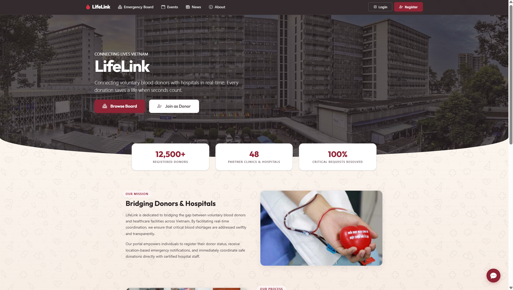
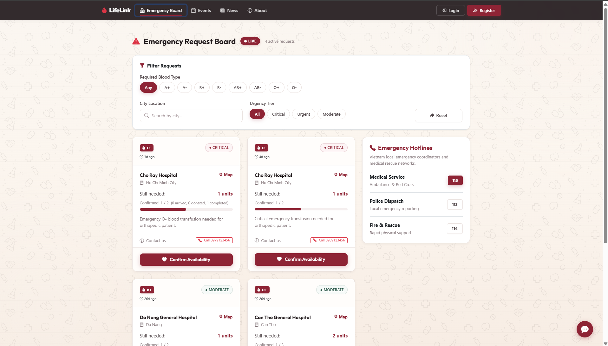
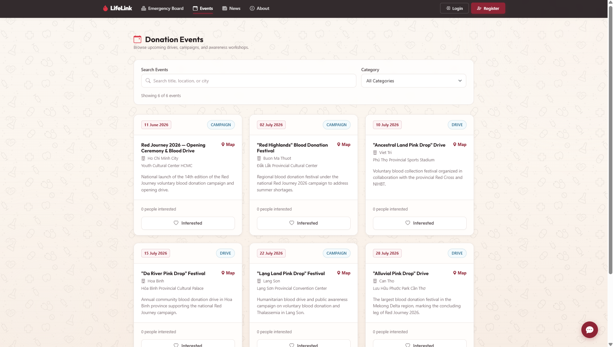
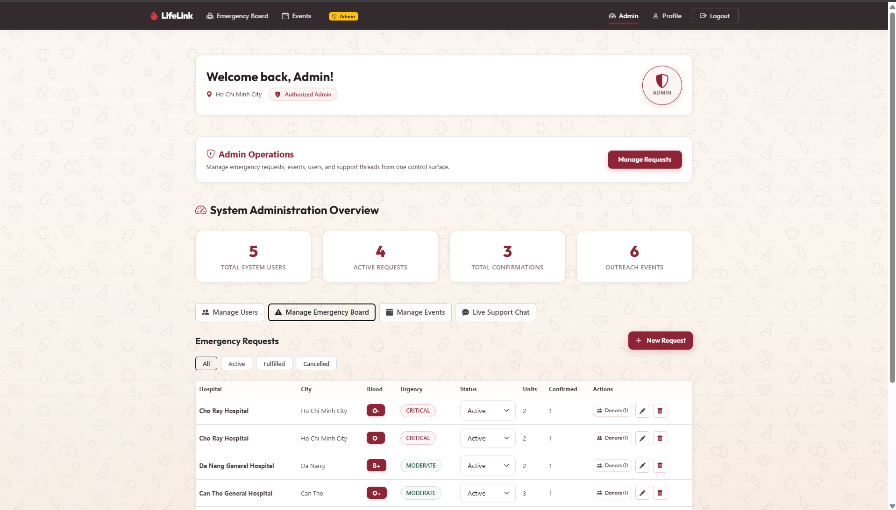
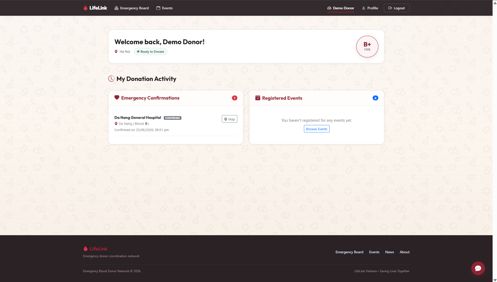

# LifeLink

LifeLink is a real-time emergency blood donor coordination web application tailored for Vietnam. The platform connects blood donors, volunteers, and hospitals to coordinate urgent transfusions.

The application is styled with a warm beige and deep crimson wine theme, focusing on semantic accessibility, clear responsiveness, and real-time updates.

---

## Interface Preview

### Home and Community Overview


### Emergency Request Board


### Outreach Events


### Admin Operations Dashboard


### Donor Dashboard


---

## Features

- **Real-Time Request Board**: Driven by Firestore real-time listeners (`onSnapshot`) to sync active requests across screens in under 1 second.
- **Vietnamese Cooldown Verification**: Enforces a 56-day (8 weeks) medical cooldown between full blood donations, calculating eligibility dynamically.
- **Live Support Chat**: An integrated communication widget available for both authenticated users and guests.
- **Dynamic Maps Routing**: Resolves coordinates and location strings to generate direct maps search queries.
- **Access Control Roles**: Provides customized views and capabilities based on session authentication:
  - **Guests**: Browse active requests, view blood type compatibility matrix, register for events, and confirm availability.
  - **Donors**: Track donation history, view cooldown countdowns, update personal profile data, and cancel availability bookings.
  - **Admins**: View dashboard analytics cards, execute CRUD operations on active requests and outreach events, and moderate system users.

---

## Technical Stack

- **Frontend Core**: Vue 3 (Composition API, `<script setup>`)
- **Styling**: Bootstrap 5 (Custom CSS overrides)
- **Database & Auth**: Google Firebase (Firestore Database, Firebase Authentication)
- **Router**: Vue Router 4 (Lazy-loaded views, navigation route guards)
- **Testing**: Vitest (Unit testing suite, Mock DOM environment)
- **Animation**: Motion One & GSAP (Subtle transition animations)

---

## Project Structure

```text
LifeLink/
├── docs/                     # Documentation assets and screenshots
│   └── screenshots/
├── public/                   # Static assets (images, icons)
├── scripts/                  # Data seeding and RSS fetching utilities
├── src/
│   ├── components/           # Reusable UI widgets
│   ├── composables/          # Modularized state hook functions (Auth, Chat)
│   ├── data/                 # Local data models and news fallbacks
│   ├── directives/           # Global directives (v-highlight-urgency)
│   ├── router/               # Route setup and access control guards
│   ├── utils/                # Pure logic helpers (blood compatibility)
│   ├── views/                # Full page views
│   ├── App.vue               # Entry component
│   └── main.js               # Entry script
├── tests/                    # Testing suite
│   ├── unit/                 # Unit testing code
│   ├── rules/                # Firestore rules compliance tests
│   └── e2e/                  # Integration testing code
├── firestore.rules           # Firestore security rule definitions
├── package.json              # NPM dependencies & test scripts
└── vitest.config.js          # Vitest build configurations
```

---

## Installation

### Prerequisites
Node.js (v18+) and npm.

### Setup Instructions

1. Clone the repository:
   ```bash
   git clone https://github.com/your-username/LifeLink.git
   cd LifeLink
   ```

2. Install dependencies:
   ```bash
   npm install
   ```

3. Configure Environment variables:
   Copy the sample environment file:
   ```bash
   cp .env.example .env
   ```
   Fill in the created `.env` with your Google Firebase project keys.

4. Run local dev server:
   ```bash
   npm run dev
   ```

5. Seed Database Collections:
   Initialize your Google Firebase collections (Users, Emergency Requests, and Outreach Events) with clean, unaccented realistic mock data:
   ```bash
   npm run db:seed
   ```
   *(Note: Ensure your Firestore Security Rules temporarily allow write access during seeding).*

6. Build production bundle:
   ```bash
   npm run build
   ```

---

## Testing Suite

LifeLink includes unit and integration tests using Vitest.

### Execute all tests:
```bash
npm test
```

### Execute tests with coverage:
```bash
npm run test:coverage
```

### Firestore Security Rules Testing:
Make sure the local Firestore Emulator is running on port 8080:
```bash
firebase emulators:start --only firestore
npm test
```
*(If the emulator is not running, the rules tests will be skipped automatically to prevent connection timeout).*

---

## License

This project is licensed under the MIT License - see the [LICENSE](LICENSE) file for details.
