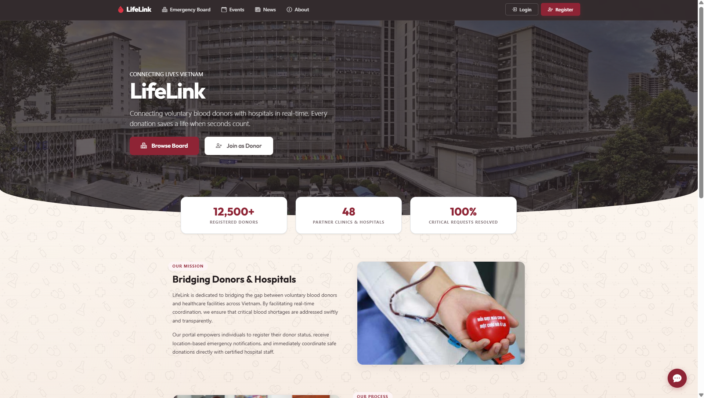
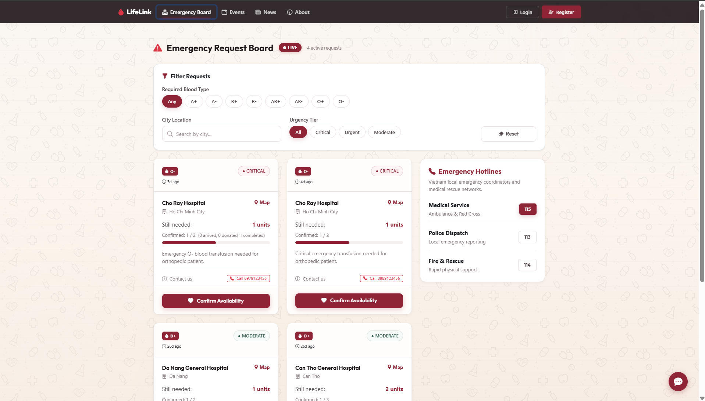
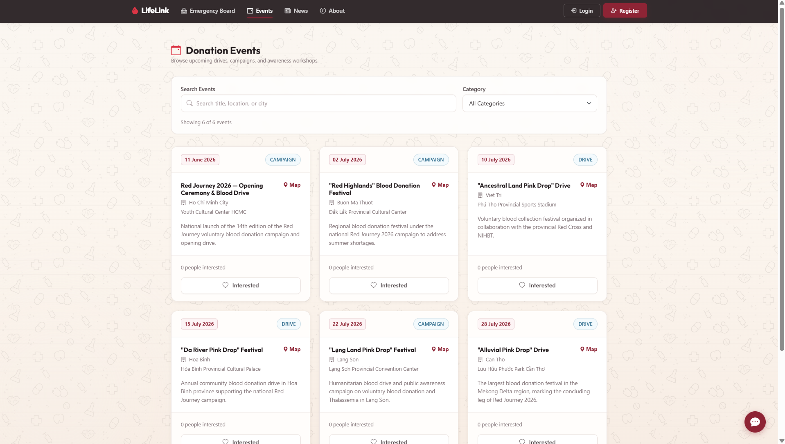
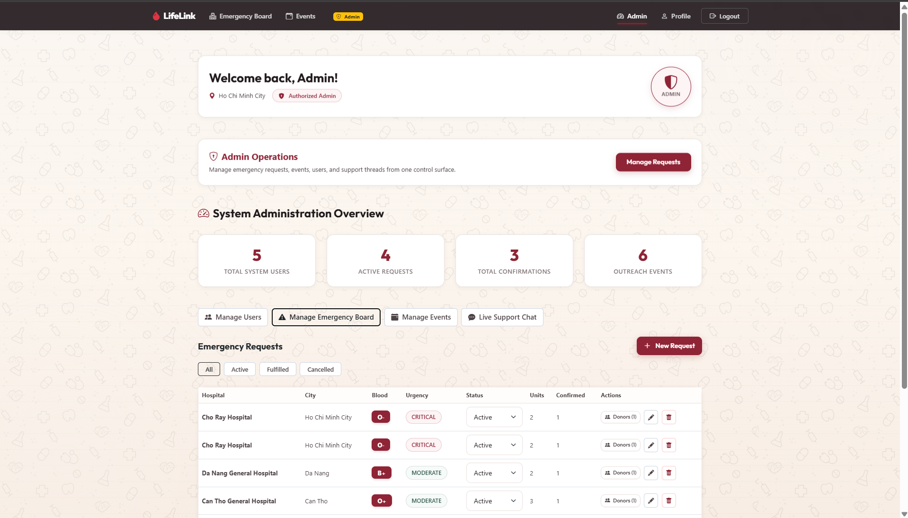
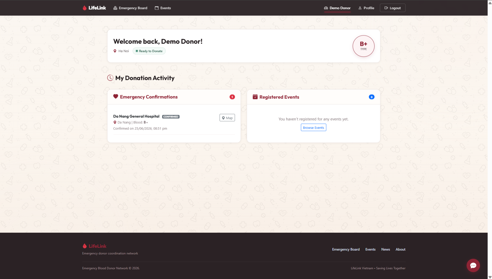

# LifeLink

LifeLink is a real-time emergency blood donor coordination web application tailored for Vietnam. The platform connects blood donors, volunteers, and hospitals to coordinate urgent transfusions.

The application is styled with a warm beige and deep crimson wine theme, focusing on semantic accessibility, clear responsiveness, and real-time updates.

---

## Interface Preview

### Home and Community Overview


### Emergency Request Board


### Outreach Events


### Admin Operations Dashboard


### Donor Dashboard


---

## Features

- **Real-Time Request Board**: Driven by Firestore real-time listeners (`onSnapshot`) to sync active requests across screens in under 1 second.
- **Live Location Tracking & Radar**: Uses Firebase Realtime Database for ephemeral, high-frequency location data. Features a Haversine-based radar map to coordinate donors in 3km and 10km radii.
- **Decentralized Demo Simulation**: An integrated live simulation engine that automatically spawns and tracks mock responders navigating toward emergency requests across Vietnam.
- **Vietnamese Cooldown Verification**: Enforces a 56-day (8 weeks) medical cooldown between full blood donations, calculating eligibility dynamically.
- **Live Support Chat**: An integrated communication widget available for both authenticated users and guests.
- **Access Control Roles**: Provides customized views and capabilities based on session authentication:
  - **Guests**: Browse active requests, view blood type compatibility matrix, register for events, and confirm availability.
  - **Donors**: Track donation history, view cooldown countdowns, update personal profile data, and share live location to hospitals.
  - **Admins**: View dashboard analytics cards, execute CRUD operations on active requests and outreach events, and moderate system users.

---

## Technical Stack

- **Frontend Core**: Vue 3 (Composition API, `<script setup>`)
- **Styling**: Bootstrap 5 (Custom CSS overrides)
- **Database & Auth**: Google Firebase (Firestore for core business logic, RTDB for high-frequency tracking, Firebase Authentication)
- **Map Engine**: Leaflet (OpenStreetMap) with OSRM routing and Map clustering.
- **Router**: Vue Router 4 (Lazy-loaded views, navigation route guards)
- **Testing**: Vitest (Unit testing suite), Playwright (E2E testing suite)

---

## Project Structure

```text
LifeLink/
├── docs/                     # Documentation assets and screenshots
├── public/                   # Static assets (images, icons)
├── scripts/                  # Data seeding and RSS fetching utilities
├── src/
│   ├── components/           # Reusable UI widgets (EmergencyMap, Chat, etc.)
│   ├── composables/          # Modularized state hooks (useLocationTracking, useLiveSimulation)
│   ├── data/                 # Local data models and hospital coordinates
│   ├── router/               # Route setup and access control guards
│   ├── utils/                # Pure logic helpers (Haversine, Blood compatibility)
│   ├── views/                # Full page views
│   ├── App.vue               # Entry component
│   └── main.js               # Entry script
├── tests/                    # Testing suite
│   ├── unit/                 # Unit testing code
│   ├── rules/                # Firestore rules compliance tests
│   └── e2e/                  # Playwright Integration testing code
├── database.rules.json       # Realtime Database rules (Tracking access)
├── firestore.rules           # Firestore security rule definitions
├── package.json              # NPM dependencies & test scripts
└── playwright.config.js      # Playwright E2E configurations
```

---

## Installation

### Prerequisites
Node.js (v18+) and npm.

### Setup Instructions

1. Clone the repository:
   ```bash
   git clone https://github.com/your-username/LifeLink.git
   cd LifeLink
   ```

2. Install dependencies:
   ```bash
   npm install
   ```

3. Configure Environment variables:
   Copy the sample environment file:
   ```bash
   cp .env.example .env
   ```
   Fill in the created `.env` with your Google Firebase project keys (including `VITE_FIREBASE_DATABASE_URL`).

4. Run local dev server:
   ```bash
   npm run dev
   ```

5. Build production bundle:
   ```bash
   npm run build
   ```

---

## Testing Suite

LifeLink includes comprehensive testing suites using Vitest for unit tests and Playwright for End-to-End tests.

### Unit & Integration (Vitest):
```bash
npm run test:unit
```

### End-to-End (Playwright):
To run browser tests (Chromium, Firefox, Webkit):
```bash
npx playwright install
npm run test:e2e
```
To open the Playwright UI mode:
```bash
npm run test:e2e:ui
```

### Firestore Security Rules Testing:
Make sure the local Firestore Emulator is running:
```bash
npm run test:rules
```

### Execute All Tests:
```bash
npm run test:all
```

---

## License

This project is licensed under the MIT License - see the [LICENSE](LICENSE) file for details.
